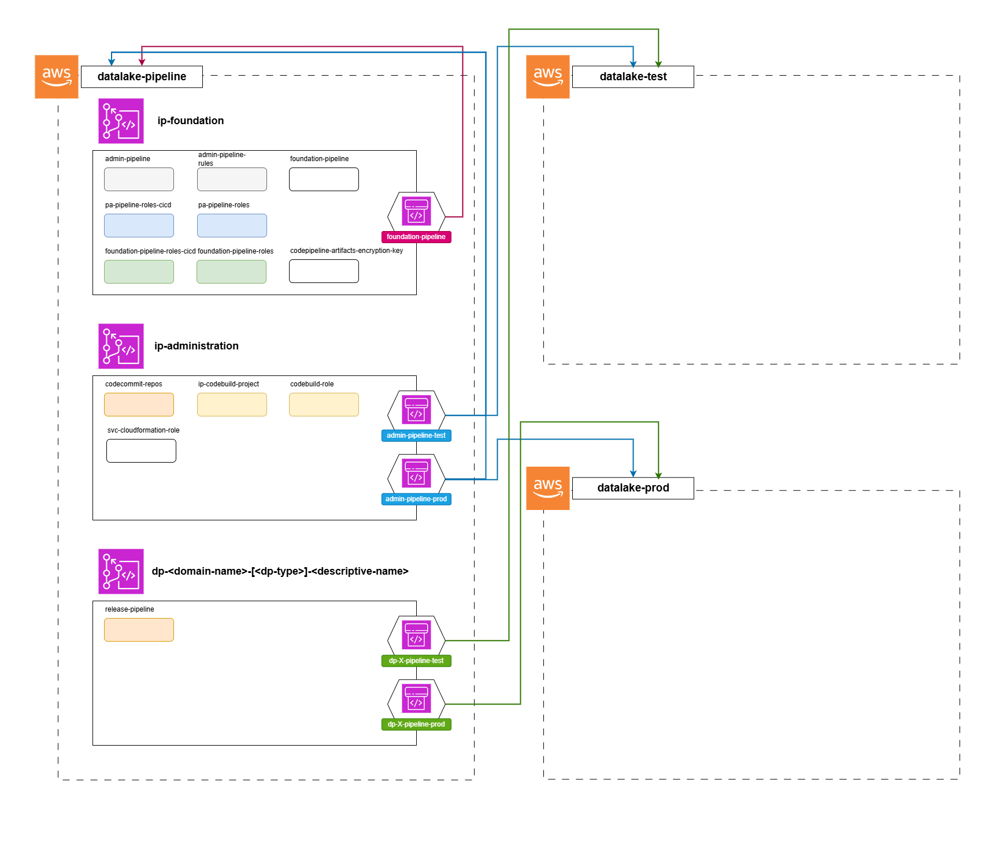
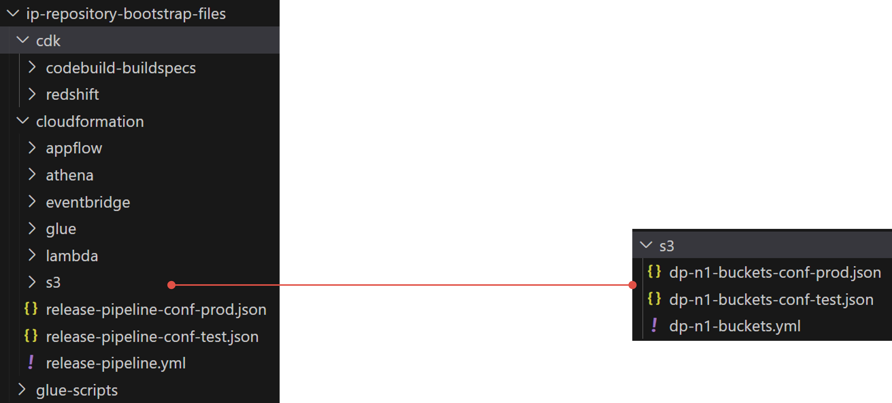
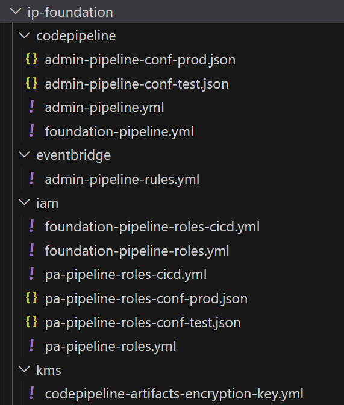
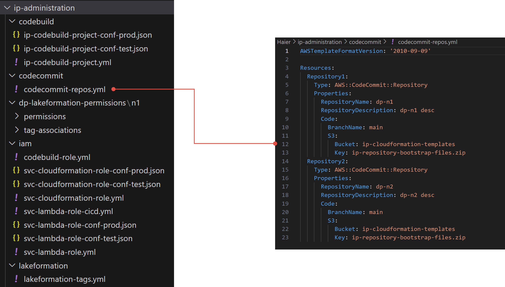

# 🏗️ Progettazione Infrastruttura e Automazione (CI/CD)

## 📖 Contesto
All’avvio del progetto non esistono strumenti di **code repository** né automazioni CI/CD.  
Le risorse vengono create direttamente tramite console e gli sviluppatori di **quattro fornitori diversi** hanno pieno accesso a qualsiasi servizio AWS.  

Il codice risiede nei job, script o nei repository di un fornitore storico. Sono state definite **linee guida** per la nomenclatura delle risorse e per l’uso corretto dei principali servizi dello stack AWS:  

- AWS S3  
- AWS Athena  
- AWS Redshift  
- AWS Glue  
- AWS AppFlow  
- AWS Lambda  

> Il cliente non possiede competenze specifiche in ambito dati: **nessun concetto di data product** né di ownership del dato.

---

## 🎯 Obiettivi del progetto
- Implementare un framework di **CI/CD** su entrambi gli account (Test / Prod)  
- Minimizzare i costi, sia progettuali sia operativi  
- Creare una soluzione compatibile con tutti i servizi AWS utilizzati dal cliente  

---

## ⚠️ Requisiti e vincoli
- Deadline definita: **circa 4 mesi**  
- Progetto **chiavi in mano**  
- Utilizzo esclusivo di tecnologie **AWS**

---

## 🛠️ Stack Tecnologico
Il progetto utilizza principalmente i servizi AWS già in uso dal cliente, integrati in un flusso automatizzato per CI/CD e gestione infrastruttura.

 **AWS S3**  
 **AWS Athena**  
 **AWS Redshift**  
 **AWS Glue**  
 **AWS AppFlow**  
 **AWS Lambda**  
 **AWS Cloud Formation**  
 **AWS Code Commit**  
 **AWS Code Build**  
 **AWS Code Pipeline**  

---

## 💡 Solutioning

La soluzione implementata prevede la creazione di un nuovo account aws da dove verrà gestita tutta la parte di CI/CD, andando quindi a limitare in modo massivo l'accesso e le modifiche degli utenti/sviluppatori da console.  

All'interno di tale account vengono attivati tre servizi:  
 **AWS Code Commit**  
 **AWS Code Build**  
 **AWS Code Pipeline**  

In particolare vengono definite delle linee guida per l'utilizzo di ciascuno, ovvero:
- ogni repository Code Commit corrisponde a un Data Product (unità atomica di deploy)
- le pipeline dei singoli repository vengono deployate in autonomia (viene fornito un template) da ciascun team di sviluppo. Lo stesso vale per le regole event bridge associate.
- l'istanziazione di un nuovo repository viene effettuata tramite richiesta su sistema di ticketing e gestita con approccio IaC

L'architettura di alto livello è riportata nell'immagine seguente:

### Code Commit repositories structure  
Ciascun nuovo repository viene creato con un'alberatura precisa e dei template predisposti per i servizi comuni più utilizzati:  

### Platform repos

Sono stati creati anche due repository:
- **ip-foundation**: contenente una serie di risorse per poter gestire il setup iniziale del framework CI/CD e, quindi, da toccare raramente.  
Tale repository contiene ad esempio:  
    - le pipeline di rilascio per il repository ip-administration 
    - i ruoli associati alle pipeline dell'account di CI/CD 
    - etc.

    
 
    
Dettaglio struttura repository ip-foundation
    
     
    

      

- **ip-administration**: contenente tutti gli asset che devono essere gestiti a livello centralizzato dal "team di piattaforma". Ad esempio:  
    - template di creazione dei repository codecommit
    - ruoli per i progetti codebuild
    - risorse utili per l'utilizzo del servizio Lake Formation (out of scope per l'esercizio)
    - etc.
    
 
    
Dettaglio struttura repository ip-administration
  
     
    

  
---

## 📝 Task

Lavorando a gruppi, l'obiettivo è quello di, a partire dalla soluzione esistente, proporre al cliente tre evolutive o feature aggiuntive rispetto allo scenario attuale.  

**Cose di cui tenere conto**
- [AWS Code Commit deprecation](https://aws.amazon.com/it/blogs/devops/how-to-migrate-your-aws-codecommit-repository-to-another-git-provider/)  
- Le decisione deve considerare i seguenti KPI:
    - Costo medio mensile CI/CD: 41$
    - Minuti medi mensili di esecuzione delle pipeline: 3500
    - Picco di minuti mensili di esecuzione delle pipeline: 7900 minuti

Non c'è un vincolo sulla dimensione della proposta ma:
- l'ambito deve rimanere l'automatizzazione e/o la CI/CD
- dev'essere fatta una proposta ragionando in termini di costo (vedi costi mensili precedenti)
- ok la tecnologia ma le proposte devono ottimizzare lo stato attuale del cliente (tradotto: bella la tecnologia ma qual è il ROI? Tangibile o intangibile che sia)

__L'output può essere consegnato in qualsiasi formato (.md, .pptx, draw.io) e caricato sulla cartella presente nel repository associata al proprio gruppo (riportato sotto).__

Ciascun gruppo avrà modo di osservare l'esposizione degli altri gruppi e, recitando la parte del cliente, "votare" la soluzione che avrebbe comprato in termini di:
- chiarezza comunicativa
- valore generato
- costo 
- effetto "wow"

### Gruppi

**Gruppo 1**  
- Nome e Cognome
- Nome e Cognome

**Gruppo 2**
- Nome e Cognome
- Nome e Cognome
- Nome e Cognome

**Gruppo 3**
- Nome e Cognome
- Nome e Cognome
- Nome e Cognome

## 👨‍🏫 Tutor
- [Daniele Uboldi](https://github.com/kagedani)
